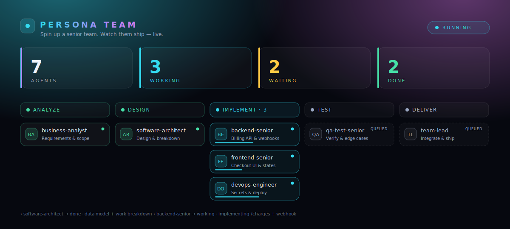

# 🤖 Persona Team

**A Claude Code add-on that turns any task into a team of 10 senior AI agents — running in parallel, watched live on a dashboard — using nothing but your Claude Code subscription.**

---

<!-- Tip: swap this for a real screenshot of your live dashboard (open http://localhost:7331 during a run) and save it as docs/dashboard.png, then update this link. -->


You type one command. A business analyst scopes the work, an architect breaks it down, and then a full team fans out in parallel — backend, frontend, devops, QA — while you watch every agent move from queued → working → done in real time on a futuristic web dashboard at `http://localhost:7331`. When they're done, the team-lead integrates the deliverables and hands back a coherent result.

No API keys. No per-token bill. One Claude Code subscription handles it all.

---

## ✨ Why Persona Team?

- **No extra cost.** Runs entirely on your existing Claude Code subscription. Opus-tier personas (architect, backend, frontend, fullstack, QA) use your model quota — nothing leaves the machine, nothing hits a billing meter.
- **Real parallelism.** Independent sub-tasks run simultaneously across multiple agents. What takes a solo dev hours can close in one focused session.
- **10 senior personas, already configured.** Business analyst, product owner, architect, team-lead, backend, frontend, fullstack, devops, QA, and a 20-year senior recruiter — each with a distinct system prompt tuned to their domain.
- **Live dashboard.** A dark, zero-dependency web UI (vanilla JS, no build step) streams every agent event via SSE. Watch the pipeline animate in real time.
- **Works on any deliverable.** Software features, recruitment pipelines, business analysis, technical design — the same `/build-team` command handles all of it.
- **Open source, MIT.** Fork it, extend it, make it yours.

---

## 📦 Install

### Prerequisites

- [Claude Code](https://claude.ai/code) subscription (required — no API key alternative)
- Node.js 18+
- macOS or Linux

### One-liner

```bash
curl -fsSL https://raw.githubusercontent.com/YOUR_GITHUB_USERNAME/persona-team/main/install.sh | bash
```

### Or clone and run

```bash
git clone https://github.com/YOUR_GITHUB_USERNAME/persona-team
cd persona-team
bash install.sh
```

### What gets installed (all global, nothing inside your repo)

| Path | What it is |
|---|---|
| `~/.claude/agents/*.md` | 10 persona system-prompt files |
| `~/.claude/commands/build-team.md` | The `/build-team` slash command |
| `~/.claude/PERSONA-TEAM.md` | Full usage reference |
| `~/.claude/persona-team/server.mjs` | Zero-dep Node 18+ dashboard server |
| `~/.claude/persona-team/public/index.html` | Live dashboard UI |
| `~/.claude/persona-team/pt.mjs` | CLI event emitter (called by the orchestrator) |

No global npm packages. No daemons. Nothing added to your `PATH` unless you want it.

---

## 🚀 Quick start

1. Install (see above).
2. Open Claude Code in any project directory.
3. Run the command:
   ```
   /build-team <describe your task here>
   ```
4. Open **http://localhost:7331** in your browser — the dashboard starts automatically on step 3.

The orchestrator will classify your task, select the right personas, assign phases, and fan out. Watch the cards animate across the pipeline columns as agents pick up work.

---

## 👥 Meet the team

| Icon | Agent | Role | Model |
|---|---|---|---|
| 📋 | business-analyst | Requirements, scope, acceptance criteria | Sonnet |
| 🧭 | product-owner | Prioritization, MVP, trade-offs | Sonnet |
| 🏛️ | software-architect | Technical design + work breakdown | Opus |
| 🎯 | team-lead | Coordinate, assign, integrate | Sonnet |
| ⚙️ | backend-senior | Server-side implementation | Opus |
| 🎨 | frontend-senior | Client-side implementation | Opus |
| 🧩 | fullstack-senior | End-to-end vertical slices | Opus |
| 🚀 | devops-engineer | CI/CD, deploy, infra | Sonnet |
| 🔬 | qa-test-senior | Tests + adversarial verification | Opus |
| 🧲 | senior-recruiter | 20-year recruitment expert | Sonnet |

Opus personas (architect, backend, frontend, fullstack, QA) produce the highest-quality output and cost more of your weekly quota. Sonnet personas handle coordination, scoping, and lighter analytical work efficiently.

---

## ⚙️ How it works

```
/build-team "add Stripe billing to the dashboard"

  Phase 0 — Orchestrator starts the dashboard server → http://localhost:7331

  Phase 1 — [📋 business-analyst] scopes requirements and acceptance criteria
           ↓
  Phase 2 — [🏛️ software-architect] produces technical design + work breakdown
           ↓
  Phase 3 — [⚙️ backend-senior] ∥ [🎨 frontend-senior] ∥ [🚀 devops-engineer]
             (run in parallel across independent work streams)
           ↓
  Phase 4 — [🔬 qa-test-senior] adversarial review + test coverage
           ↓
  Phase 5 — [🎯 team-lead] integrates all deliverables, resolves conflicts, ships
```

Each phase emits live events to the dashboard. You can read along, intervene, or just wait for the team-lead's final summary.

---

## 🖥️ The live dashboard

Open **http://localhost:7331** at any time during (or after) a run.

What you see:

- **Pipeline columns** — Queued / Working / Done, one card per agent per phase.
- **Working cards glow** with a live elapsed timer; done cards lock with a completion stamp.
- **Activity feed** — a scrolling log of every event the orchestrator emits (phase transitions, agent assignments, key log lines).
- **Live stat bar** — total agents, active right now, completed, phases done.
- **SSE auto-reconnect** — if the server restarts mid-run, the dashboard reconnects and replays the latest snapshot automatically.

The server is stateless between page loads — it holds the current run state in memory and broadcasts snapshots on connect. Stop it any time: `pkill -f persona-team/server.mjs`.

---

## 💸 Costs & quota

Persona Team uses **only your Claude Code subscription**. There is no API key, no Anthropic API billing, and no third-party service.

What that means in practice:

- Opus personas (architect, backend, frontend, fullstack, QA) consume more of your weekly model quota than Sonnet ones.
- Running many agents in parallel multiplies quota consumption proportionally.
- **Recommended limits:** Claude Max 5x plan → keep parallel opus agents to 2–3 per phase; Claude Max 20x → up to 5 parallel opus agents comfortably.
- The orchestrator automatically skips personas that aren't needed for your task type — don't worry about over-staffing.

---

## 🛠️ Customize

Personas are just markdown files. Open any of them in `~/.claude/agents/` and edit the system prompt:

```bash
# Example: make the QA engineer focus on security testing
open ~/.claude/agents/qa-test-senior.md
```

To add a new persona, drop a `.md` file in `~/.claude/agents/` with a `---` frontmatter block that includes `name`, `description`, and `model`. The orchestrator will discover it on the next run.

To change the dashboard port:

```bash
export PERSONA_TEAM_PORT=8080
```

---

## 🗑️ Uninstall / restore

The installer backs up any existing files it touches:

```bash
# Restore backed-up files (installer names them <file>.<timestamp>.bak).
# If you have several backups of one file, pick the timestamp you want instead.
for f in ~/.claude/agents/*.bak; do mv -i "$f" "$(echo "$f" | sed -E 's/\.[0-9]{8}-[0-9]{6}\.bak$//')"; done

# Remove everything Persona Team added
rm -rf ~/.claude/persona-team
rm ~/.claude/commands/build-team.md
rm ~/.claude/PERSONA-TEAM.md
```

Your Claude Code configuration is otherwise untouched.

---

## 📄 License

MIT — do whatever you want with it. Attribution appreciated but not required.

---

> **Meta note:** The README you're reading, the LinkedIn launch post, and the release packaging for this tool were produced by the persona team itself — BA → architect → frontend, devops, product-owner in parallel → QA → team-lead — watched live on the dashboard it was shipping. The tool built its own launch.
